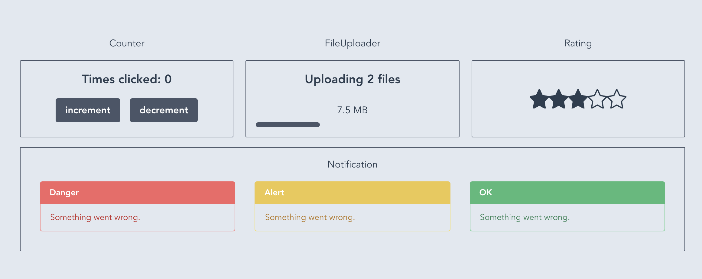

# Vue Personal Testing Components

This repository contains a series of Vue components made using [TDD](https://en.wikipedia.org/wiki/Test-driven_development).

The goal is learning TDD in the frontend using Vue with Typescript, Jest and vue-test-utils.

This repo uses the awesome library [Tailwind CSS](https://tailwindcss.com/) for the styling.

## Actual components

 - Counter [(inspired by Adri Fontcuberta)](https://www.youtube.com/watch?v=DD1fEhcEzY8)
 - File Uploader [(inspired by Sarah Dayan)](https://www.youtube.com/watch?v=OPWcqgqiJao)
 - Rating [(inspired by Sarah Dayan)](https://www.youtube.com/watch?v=DD1fEhcEzY8)
 - Notification
 - Search Box (**PENDING**)



## Run the project
```
yarn install // npm install
```

### Run server
```
yarn serve // npm run serve
```

### Run unit tests
```
yarn test:unit // npm run test:unit
```
